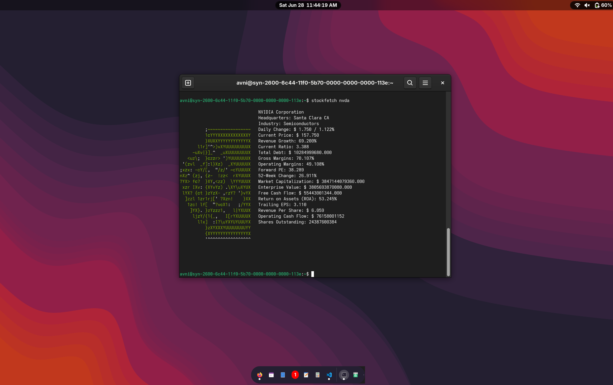

# Stockfetch

**Think Neofetch for stocks**

**Notes:**

As with neofetch, this isn't meant to be a representation of L2 data or anything, just a cute, simple CLI for stock nerds to show off.

> Happy stock tracking!

